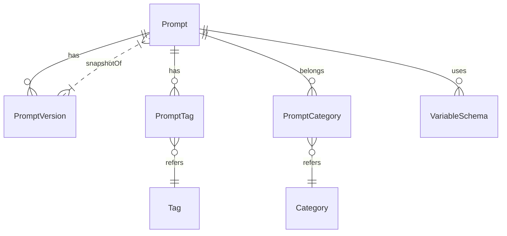
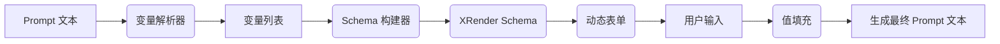

**执行摘要：** 本套文档基于前期讨论，将“Prompt Studio”项目的架构与需求进行整理，并生成完整的文档集，包括 README、需求文档、设计文档、路线图、任务细分、AI 规范、架构决策等。其中涵盖技术栈（Next.js、TypeScript、TailwindCSS、shadcn/ui、Monaco 编辑器、XRender 表单、Dexie/IndexedDB、Zustand 等）及各模块设计要点。设计文档中通过示意图（ER图、流程图、分层图、路由树）说明系统结构。路线图按照 AI Vibe Coding 模式拆分为约30个独立任务，每个任务描述目标、前置条件、修改/新增文件、验收标准等。AI 编码规范和架构决策确保一致性。最后提供 docs 目录的文件清单与 JSON 索引，以便导出使用。

---

## README.md

### 项目简介  
**Prompt Studio** 是一个面向开发者和 AI 从业者的**本地优先（Local First）Prompt 工作台**，用于管理和编辑 AI Prompt。它专注于 Prompt 的编写、版本管理、变量填充与交互式渲染，不提供 AI 聊天、调用模型服务等功能。用户可以在本地环境中方便地创建、分类、搜索和复制 Prompt 模板，并通过自定义变量（如文本、选择、日期、图片上传等）生成最终的 Prompt。  

### 项目定位  
- **纯文本 Prompt 编辑**：使用简洁的 `{{变量名}}` 占位符语法，不嵌入任何 UI 信息或特殊指令。  
- **本地优先存储**：使用 IndexedDB（Dexie）作为离线存储，确保数据本地化；未来可无缝迁移到远程存储而不改动业务层。  
- **工程化管理**：提供Prompt版本历史、对比和回滚；并支持分类、标签、收藏和评分等元数据管理。  
- **可扩展性**：架构采用模块化设计，独立的 Schema 系统和存储层抽象，为后续接入云同步、团队协作、AI 辅助等留足空间。  

### 技术栈  
- **框架**：Next.js (App Router) + TypeScript。  
- **样式**：Tailwind CSS + shadcn/ui 组件库，用于快速构建美观的响应式界面。  
- **编辑器**：Monaco Editor（即 VSCode 编辑器内核），提供代码编辑、语法高亮、Diff比较等功能。  
- **表单**：XRender（基于 JSON Schema 自动生成交互表单）用于渲染 Prompt 变量输入界面。  
- **状态管理**：Zustand（简洁高效的 React 状态库），降低样板代码量。  
- **数据库**：Dexie.js + IndexedDB（浏览器内置离线数据库），实现本地持久化。  
- **其它**：ESLint、Prettier、Git Hooks（Husky）等保证代码质量；Monaco Diff Editor 用于对比 Prompt 版本。  

### 快速开始  
1. 使用 `pnpm create next-app@latest --ts --tailwind` 初始化项目（选择 App Router）。  
2. 安装 shadcn/ui：`pnpm dlx shadcn@latest init` 并添加所需组件。  
3. 配置 Dexie 数据库和 Zustand Store。  
4. 运行 `pnpm dev` 启动开发服务器，访问 `http://localhost:3000`。  
5. 创建第一个 Prompt 模板：填写名称、内容并保存，即可在首页列表中看到。  

---

## REQUIREMENTS.md（需求文档 / PRD）

### 1. 产品定位  
- 本地优先（Local First）Prompt 编辑和管理工具：专注于 Prompt 模板的编写、变量填充与渲染，一切数据默认保存在本地 IndexedDB。  
- 主要功能：Prompt 的 **CRUD**、版本管理、可视化变量交互、分类标签管理、搜索与导出等。  
- 目标用户：AI 工具开发者、提示词工程师、数据标注人员等，需要离线/本地管理复杂提示模板的用户。  

### 2. 核心需求  

1. **Prompt 管理**：  
   - 本地存储 Prompt 数据，包括名称、正文、分类、标签、评分、备注、示例等。  
   - 支持多版本历史：保存每次修改的快照，可对比和回滚。版本间差异以代码 Diff 形式展示。  
   - 标记和检索：支持给 Prompt 添加星标收藏；可按关键词、分类、标签、更新时间等多维度搜索和筛选。  
   - 导入/导出：允许将单个或全部 Prompt 数据导出为 JSON（及未来 Markdown、ZIP等格式），或从 JSON 恢复。  

2. **变量系统**：  
   - Prompt 支持 `{{variable}}` 占位符，表示输入模板中的可变内容。  
   - 独立的 Schema 系统管理变量：使用 JSON Schema 配置每个变量的输入类型（文本、数值、下拉、多选、日期、时间、图片上传等）、默认值、必填、校验规则、描述等。  
   - 编辑时自动解析 Prompt 中出现的所有 `{{变量}}`，生成对应的表单控件（使用 XRender）。用户填写后生成最终 Prompt 文本。  
   - 可视化 Schema 编辑：允许用户动态修改变量类型和规则，如把变量切换为 Select、Textarea、DatePicker 等，并保存到数据库。  
   - 新变量自动发现：若 Prompt 新增未定义变量，系统提示创建 Schema。  

3. **搜索与分类**：  
   - **分类**：一层结构，用于组织 Prompt（如“翻译”、“写作”、“编程”等）。用户可创建、修改、删除分类。  
   - **标签**：扁平字符串，支持多选。标签例子：“GPT”，“Claude”，“SEO”，“coding”。用于细粒度标记。  
   - 支持标签/分类/关键词的全文搜索和过滤，结合最近使用、收藏、评分排序等多维条件。  

4. **版本管理**：  
   - 提供版本列表：记录每次保存的时间戳和内容快照。  
   - 支持版本对比（使用 Monaco Diff 编辑器），查看不同版本之间的变更。  
   - 支持版本回滚：一键将选中旧版本设为当前版本。  
   - 手动保存版本：修改 Prompt 内容后需用户确认保存或自动快照。  

5. **导入导出**：  
   - 支持将整个文档库导出为 JSON 文件，并可从 JSON 一键导入恢复，包含所有 Prompt 数据、分类、标签等。  
   - 导出过程可指定格式（JSON/Markdown/ZIP），并提供示例命令。  
   - 导入时检测冲突，提供提示选择覆盖或重命名。  

6. **UI 样式**：  
   - 使用**Tailwind CSS + shadcn/ui** 组件库构建现代化响应式界面。  
   - 主题支持暗黑模式。布局参考典型的 IDE 风格，包括导航栏、侧边列表、编辑器主区和右侧面板。  

7. **AI Vibe Coding 任务化拆分**（新增说明）：  
   - 开发过程严格按照“阶段 → 独立任务”模式进行拆分（约 30 个任务）。  
   - 每个任务小而清晰，可由 AI 辅助工具（如Claude Code、Cursor等）独立完成。  
   - 任务描述包含目标、前置条件、修改/新增文件列表、验收标准等，确保可管理性。  

8. **隐私模式**：  
   - 支持“隐藏”状态：在普通模式下不可见的 Prompt，需切换到隐私模式后才能查看、编辑或导出。  
   - 隐私模式入口设计隐蔽（例如连续点击页面角落若干次才出现切换按钮）。  

### 3. 技术与实现要点  
- **存储**：首期仅本地 IndexedDB（通过 Dexie 封装）。后续可插拔远程存储适配（抽象 Repository 层）。  
- **版本**：仅保存完整快照，不存 Diff 差量，Diff 动态渲染。  
- **编辑器**：使用 Monaco 实现 Prompt 文本编辑，获得代码高亮和 Diff 功能。  
- **表单**：基于 XRender 根据 Schema 自动生成用户界面，用于变量输入。Prompt 变量与表单解耦。  
- **前端框架**：全 React + Next.js 单页，所有交互式组件采用 Client Components；状态管理用 Zustand。  
- **其他**：设置页用于切换隐私模式、全局选项；快捷键和插件接口预留。  

### 4. 明确不做（边界）  
- **不负责 AI 调用/聊天**：不集成 OpenAI、Claude 等模型 API。Prompt 最终输出通过复制到其他平台使用。  
- **不支持 Folder 结构**：只用分类(Category)和标签(Tag)管理 Prompt。  
- **不支持 Prompt 引用/继承**：每个 Prompt 独立，不允许模板引用或合并。  
- **图片管理**：首期忽略 Prompt 中上传的图片库，相关变量仅支持用户上传或提供链接。  
- **高级功能**：ComfyUI、R2 图床、协同编辑、Team 多人协作、云同步等留作后续扩展。  

---

## DESIGN.md（架构设计）

### 架构概览  
系统采用**本地优先**的客户端架构，主要层次：  

```
UI (Next.js/React + Tailwind/shadcn)
    ↓
Zustand Store （状态管理）
    ↓
Repository 层（提供数据访问接口）
    ↓
Dexie (IndexedDB 存储)
```

- **UI 层**：使用 Next.js App Router 构建单页应用（SPA），页面主要包括Prompt列表、编辑器、变量面板、历史记录等。界面风格以卡片和表单为主。  
- **状态管理**：所有界面状态（当前Prompt、变量值、查询条件、模式开关等）都由 Zustand 管理；避免 Redux 的样板代码。  
- **Repository 抽象**：对接底层数据库的读写通过 Repository 模式封装，实现与 Dexie 的解耦。后续可添加 RemoteRepository 切换到云端存储。  
- **数据库**：Dexie.js 简化 IndexedDB 的使用。定义 Prompt、Version、Category、Tag、VariableSchema 等表结构。  

### 数据模型 (ER图)  



 *图：示例性实体关系图，表示 Prompt 与版本、分类、标签、Schema 之间的关系。*  

- **Prompt**：主实体，包含ID、标题、正文、当前版本ID、引用的 SchemaID 等字段。  
- **PromptVersion**：保存每次发布的快照，只记录版本快照内容，不记录元数据（备注、标签等）。  
- **Category**：一级分类表，与 Prompt 通过外键关联。  
- **Tag**：标签表，以字符串形式存储；与 Prompt 通过多对多关联（可自行实现关联表 PromptTag）。  
- **VariableSchema**：变量定义表。每个 Prompt 可引用一套 Schema（schemaId），Schema 记录各变量的类型、默认值、选项等。  

> **设计要点**：Prompt仅存 Schema 引用ID，而不在正文中嵌入任何变量类型信息。变量类型与输入方式完全由独立的 Schema 管理，保持 Prompt 文本纯净。  

### 模块划分  
- **Prompt 模块**：实现 Prompt 的创建/编辑/删除、版本历史、对比和回滚。Prompt 编辑器使用 Monaco 实现增删改查，并触发 Schema 解析。  
- **变量模块**：负责解析 Prompt 中的变量，占位符使用 `{{name}}` 语法；动态生成 XRender 表单来接受用户输入；提供可视化编辑 Schema 的界面。  
- **分类/标签管理**：提供分类的增删改查操作、标签的输入和自动补全功能。可在 Prompt 列表和编辑页切换筛选条件。  
- **设置/系统模块**：包括隐私模式切换、导入导出、翻译辅助等全局功能。  

### 变量解析流程  



 *图：Prompt 变量解析与渲染流程。Prompt 文本经解析提取 `{{变量}}` 列表，结合 Schema 构建交互表单，用户填写后生成最终 Prompt。*  

1. **解析**：提取 Prompt 中所有 `{{variable}}`。  
2. **Schema 管理**：读取已有 Schema 定义；若无定义，提示新建。每个变量对应一个 Schema 条目（含类型、UI 控件配置等）。  
3. **构建表单**：将变量列表与 Schema 转换为 XRender JSON Schema，动态生成表单界面。  
4. **渲染填充**：用户填写表单后，将输入值回填到 Prompt 模板，生成最终内容。  

> **双层 Schema 设计**：变量定义分层管理。一套**基础 Schema**可被多个 Prompt 共享，每个 Prompt 可覆盖部分属性（如默认值）。Prompt 保存时只存引用，Schema 存库统一管理。  

### 存储与 Repository  

```mermaid
graph LR
    UI[UI (Next.js)] --> Store[Zustand Store]
    Store --> Repo[PromptRepository]
    Repo --> Dexie[IndexedDB (Dexie)]
```

 *图：数据访问层次图。UI 与状态 Store 解耦，通过 Repository 访问 Dexie 数据库。*  

- **Repository**：提供统一接口（getPrompt、savePrompt、queryPrompt 等），内部封装对 Dexie 的调用。  
- **分层好处**：未来若需要切换存储类型（本地 IndexedDB ↔ 远程API），只需替换 Repository 实现，无需改动 UI/Store 逻辑。  

### 页面路由结构  

```mermaid
flowchart TD
    Home[/]\nDashboard
    Home --> List{Prompt 列表}
    Home --> Editor{Prompt 编辑器}
    Home --> Search{搜索页面}
    Home --> Categories{分类管理}
    Home --> Tags{标签管理}
    Home --> Settings{设置}
    Editor --> Versions{版本历史}
    Editor --> SchemaEditor{Schema 编辑}
```

 *图：页面路由树（示意）。关键页面包括：Dashboard、Prompt 列表、Prompt 编辑器（含版本面板、Schema 编辑）、分类管理、标签管理等。*  

- `Dashboard (/)`：显示最近修改的 Prompt、收藏、统计信息等。  
- `Prompt 列表 (/prompts)`：展示所有 Prompt 条目，支持搜索和筛选。  
- `Prompt 编辑器 (/prompts/[id])`：使用 Monaco 编辑 Prompt 纯文本，右侧展示 Schema 表单和版本历史。  
- `版本历史`：列出所有版本快照，可对比和回滚。  
- `分类管理、标签管理 (/categories, /tags)`：维护分类与标签。  
- `设置 (/settings)`：隐私模式开关、导入导出、翻译等全局功能。  

### 隐私设计  
- **普通模式**：默认状态，显示所有非隐藏 Prompt。  
- **隐藏模式**：需要特定操作（如连续点击某区域或密码验证）才能启用。启用后显示被标记为“隐私”或“隐藏”的 Prompt，以及允许其导出。  
- **保护策略**：尽管功能上并非严格加密，但通过设计隐藏入口增加安全性；敏感内容可在此模式下管理与导出。  

### 版本边界  
- **版本内容**：每个版本只保存 Prompt **正文和变量 Schema**（影响渲染的部分），不保存分类、标签、备注等元数据。  
- **理由**：确保版本聚焦于 Prompt 文本本身的演进；其他属性变更仅体现在 Prompt 实体的当前状态中，不影响版本快照。  

> 以上为系统的整体设计方案，为后续的任务拆分与开发提供基础。所有功能按照“V1：MVP”与“后续扩展”区分，实现核心需求后逐步完善。  

---

## ROADMAP.md（开发路线）

本项目采用**阶段（Stage）→任务（Task）**的开发方式，每个任务均可独立完成，适合使用 AI 辅助工具独立执行。约拆分为 30 个任务，每个任务描述见 TASKS/ 目录。下表为各阶段及对应任务摘要：

- **Stage 1：项目初始化**  
  - Task 001: 初始化 Next.js 项目（App Router, TypeScript, Tailwind, shadcn 环境）。  
  - Task 002: 安装并配置 Tailwind CSS 与 shadcn/ui。  
  - Task 003: 配置 ESLint、Prettier 和 Husky。  
  - Task 004: 搭建基础页面布局和路由框架。  

- **Stage 2：基础架构**  
  - Task 005: 集成 Dexie 并定义 IndexedDB 表结构。  
  - Task 006: 实现 Repository 模式框架（PromptRepository 接口定义）。  
  - Task 007: 配置 Zustand 状态管理基础（全局 Store）。  
  - Task 008: 定义 TypeScript 类型和数据模型接口。  

- **Stage 3：Prompt 管理**  
  - Task 009: Prompt 实体的 CRUD（列表、创建、删除）。  
  - Task 010: 分类（Category）管理界面和逻辑。  
  - Task 011: 标签（Tag）管理界面和逻辑。  
  - Task 012: 提示词收藏与评分功能。  
  - Task 013: 最近使用时间戳记录更新。  

- **Stage 4：编辑器**  
  - Task 014: 集成 Monaco Editor 作为 Prompt 文本编辑器。  
  - Task 015: 实现手动保存版本功能（版本快照）。  
  - Task 016: 提示词复制按钮（复制当前 Prompt 文本）。  

- **Stage 5：变量系统**  
  - Task 017: 实现变量解析模块（解析 `{{}}` 占位符）。  
  - Task 018: Schema 构建器：根据变量列表生成 XRender 表单 Schema。  
  - Task 019: 集成 XRender 渲染表单，实现变量输入交互。  
  - Task 020: Schema 编辑界面：允许修改变量类型、选项、默认值等。  
  - Task 021: 自动发现新变量：保存提示未定义变量时提示创建 Schema。  

- **Stage 6：版本管理**  
  - Task 022: 显示版本历史列表。  
  - Task 023: 实现 Monaco Diff 查看版本差异。  
  - Task 024: 回滚功能：将选定历史版本设为当前版本。  

- **Stage 7：搜索与筛选**  
  - Task 025: 实现全局搜索（标题、备注、标签内容）。  
  - Task 026: 分类、标签筛选功能。  
  - Task 027: 收藏和最近使用排序筛选。  

- **Stage 8：导入导出**  
  - Task 028: JSON 导出功能（全库或单个）。  
  - Task 029: JSON 导入功能，处理冲突合并。  
  - Task 030: 导入/导出进度与确认提示。  

- **Stage 9：系统设置**  
  - Task 031: 隐私模式切换设置（隐藏入口方案）。  
  - Task 032: 翻译辅助开关和界面（仅阅读模式）。  
  - Task 033: 快捷键配置和帮助。  

- **Stage 10：后续扩展（预留）**  
  - 云端同步、团队协作、图片资源、Agent/工作流等功能接口预留，不在 V1 实现。

---

## TASKS/ 目录（任务详述示例）

下面列出各 Task 文件名和摘要，便于 AI 工具快速定位（实际文件名可加序号前缀）：

- **001-project-init.md** – 初始化 Next.js (App Router) + TypeScript + Tailwind + shadcn 项目框架。  
- **002-config-style.md** – 配置 Tailwind CSS，安装 shadcn/ui（执行 `pnpm dlx shadcn@latest init`）。  
- **003-setup-lint.md** – 设置 ESLint、Prettier 和 Husky 钩子，确保代码质量和提交格式化。  
- **004-layout-routes.md** – 搭建基本页面框架（导航栏、侧边栏、空白主页等）。  
- **005-dexie-init.md** – 安装 Dexie，定义数据库模式和表（Prompt、Version、Category、Tag、VariableSchema）。  
- **006-repository-pattern.md** – 创建数据访问层（PromptRepository、VersionRepository 等接口和 Dexie 实现）。  
- **007-store-init.md** – 配置 Zustand 全局 Store，定义基本状态模型（当前 Prompt、变量值、UI 状态等）。  
- **008-types-definition.md** – 编写 TypeScript 类型接口（Prompt、Version、Category、Tag、Schema 等）。  
- **009-prompt-crud.md** – 实现 Prompt 列表和新建/删除功能；更新数据后触发状态刷新。  
- **010-category-crud.md** – 分类管理功能：增删改查分类，关联 Prompt。  
- **011-tag-management.md** – 标签输入和管理，包括在 Prompt 编辑中添加多选标签功能。  
- **012-favorite-and-rating.md** – 提示词收藏（星标）和评分功能，支持在列表中标记常用 Prompt。  
- **013-last-used.md** – 点击复制或编辑时更新 `lastUsedAt` 字段；列表支持最近使用排序。  
- **014-editor-integration.md** – 集成 Monaco Editor 组件于编辑器页面，配置语法高亮与基本设置。  
- **015-save-version.md** – 手动保存版本按钮：将当前 Prompt 文本和 Schema 存入 Version 表。  
- **016-copy-prompt.md** – 实现“一键复制”功能，将生成的 Prompt 内容复制到剪贴板。  
- **017-var-parser.md** – 实现变量解析函数，提取 `{{}}` 中的变量名列表。  
- **018-schema-builder.md** – 根据解析出的变量列表和已有 Schema 定义，构建 XRender 表单的 JSON Schema。  
- **019-xrender-form.md** – 集成 XRender 表单库，用构建好的 Schema 渲染输入表单，让用户填写变量值。  
- **020-schema-editor.md** – 可视化编辑变量 Schema 的界面：修改类型（Input/Select/Date等）、默认值、选项。  
- **021-new-var-detect.md** – 新变量检测：如果编辑 Prompt 时出现尚未定义的变量名，提示并辅助创建新 Schema。  
- **022-version-list.md** – 版本历史页面：列出所有版本快照，显示创建时间。  
- **023-monaco-diff.md** – 在版本历史中实现 Monaco Diff 对比视图，突出新增/删除内容。  
- **024-rollback.md** – 回滚功能：将选中版本的内容设为当前 Prompt 的内容并保存版本。  
- **025-search.md** – 全局搜索功能：在 Prompt 列表页面实现关键词搜索（标题、备注、正文）。  
- **026-filter.md** – 分类和标签过滤：在列表页添加筛选下拉菜单，支持多条件组合筛选。  
- **027-sort-favorite.md** – 列表排序功能：可按收藏、评分、最近使用、修改时间等排序显示。  
- **028-export-json.md** – JSON 导出功能：将选定 Prompt 或整个数据库导出为 JSON 文件。  
- **029-import-json.md** – JSON 导入功能：读取 JSON 数据并合并到本地数据库，处理冲突。  
- **030-export-command.md** – 示例导出命令：提供如 `zip -r prompt-docs.zip docs/` 等示例。  
- **031-privacy-mode.md** – 实现隐私模式开关：设计隐藏入口逻辑（如连点触发），切换视图模式。  
- **032-translation-assist.md** – 翻译辅助：开启时显示 Prompt 的翻译版本（不保存）。  
- **033-keybindings.md** – 快捷键配置：例如 Ctrl+S 保存、Ctrl+F 搜索，提供可定制选项。  

（以上任务采用“目标/前置条件/修改文件/新增文件/输出/验收标准”等固定模板，见 AI_RULES.md 中示例。）  

---

## AI_RULES.md（AI 编码规范）

- **单一功能原则**：每个 Task 只实现一个功能改动。不得在一个 Task 中顺带重构无关代码或添加额外特性。  
- **改动范围限制**：建议每个 Task 的改动量不超过 ~500 行，以便 AI 输出可控、易于 Review。  
- **可运行性**：每个 Task 结束时代码必须**可编译并运行**，通过基础测试或手动检查。  
- **Lint 检查**：所有代码应符合 ESLint/Prettier 规则，使用 `npm run lint` 校验并自动修复。  
- **分层职责**：禁止组件直接访问 Dexie；UI 组件只负责呈现，业务逻辑放在 Hook/Store/Repository。  
- **Zustand 存储**：Zustand Store 仅保存 UI 状态，不持久化业务数据。所有持久化操作通过 Repository。  
- **Prompt 与 Schema**：Prompt 实体中**不存 Schema 详情**，只引用 `schemaId`；Schema 独立存在。  
- **版本存储**：永远保存**快照**（全文存储），不存差量，Diff 在界面渲染时动态计算。  
- **格式和命名**：遵循驼峰命名，组件名首字母大写（如 `PromptCard`、`VariablePanel`、`SchemaEditor` 等）。  
- **分层组件**：优先编写 Server Component 页面；所有带状态或交互的部分使用 Client Component。  
- **任务模板**：每个 Task 文档应包含：目标（Goal）、前置条件、修改文件、新增文件、输出内容、验收标准和禁止修改项。  
- **禁止提前实现**：勿在早期阶段实现未要求的后续功能（如 Remote Sync、团队协作等）。  

---

## ARCHITECTURE_DECISIONS.md（架构决策）

| 决策项                  | 决策说明                                             |
|-----------------------|--------------------------------------------------|
| 架构框架               | Next.js (App Router) + React + TypeScript                    |
| UI 库                 | Tailwind CSS + shadcn/ui                               |
| 编辑器                | Monaco Editor（VSCode 内核）              |
| 表单方案              | XRender（基于 JSON Schema 生成表单）                    |
| 状态管理               | Zustand（轻量级 Hook 状态库）             |
| 本地存储               | IndexedDB（通过 Dexie 封装，离线优先）      |
| Repository 抽象        | 是（支持 IndexedDB 和未来的 Remote）               |
| Prompt 存储格式       | 纯文本 + `{{变量}}` 占位符（不嵌入 UI 信息）           |
| Schema 存储           | 独立实体，Prompt 只引用 ID，不放在正文中                 |
| 版本存储               | 快照（全文存储）；Diff 动态计算                     |
| 分类层级               | 一级分类                                           |
| 标签                   | 扁平字符串（单级，不支持子标签）                     |
| 隐私模式               | 支持（隐藏模式下 Prompt 不可见，需切换后查看）           |
| 翻译功能               | 仅供阅读辅助（不保存或新建版本）                     |
| MVP 不包含            | 不包含 AI 调用、Prompt 引用、文件夹结构、远程同步等功能   |
| 未来扩展              | 图片资源、云同步、团队协作、Agent/Workflow 接口等        |

---

## 导出及使用指南

- **导出格式**：所有文档均为 Markdown 格式，docs 目录下可以使用 `zip -r docs.zip docs/` 命令打包为 ZIP 文件进行分享。或使用脚本将目录结构导出为 JSON 索引。  
- **示例命令**：  
  ```bash
  # 打包 Markdown 文档
  zip -r PromptStudio-docs.zip docs/
  # 将 docs 目录生成 JSON 索引（伪示例）
  node generate-docs-index.js docs/ --format=json > docs/index.json
  ```  
- **在其它上下文使用**：这些文档可作为**AI 助手或团队协作**的参考基础。比如：
  - 向 AI 提供 README/需求文档，让 AI 根据规格生成代码或测试用例。  
  - 在代码审查或任务分配时引用 DESIGN.md 中的架构和模块说明。  
  - 使用 ROADMAP.md 和 TASKS/ 内容进行迭代管理，将任务导入项目管理工具。  

---

**文件清单：**

| 文件路径                           | 说明                  |
|-------------------------------|---------------------|
| `docs/README.md`              | 项目简介、定位、技术栈、快速开始 |
| `docs/REQUIREMENTS.md`        | 最终需求/PRD（含新增说明）   |
| `docs/DESIGN.md`              | 技术架构设计、数据模型、模块划分等 |
| `docs/ROADMAP.md`             | 开发路线图（分阶段Stage→Task） |
| `docs/TASKS/001-project-init.md` ... <br>`docs/TASKS/033-keybindings.md` | 各任务详情（30+个 Task 文档） |
| `docs/AI_RULES.md`            | AI 编码规范和任务约束     |
| `docs/ARCHITECTURE_DECISIONS.md` | 已定架构决策表       |
| `docs/index.json` (可选)      | 文档目录 JSON 索引    |

**备注：** 所有内容均参考了前期讨论的要点，并结合常见实践进行了整理。Markdown 文档已按照规范分节和使用要点列表，便于复制与编辑。如需调整，请参考任务拆分和 ADR 表中记录的决策。