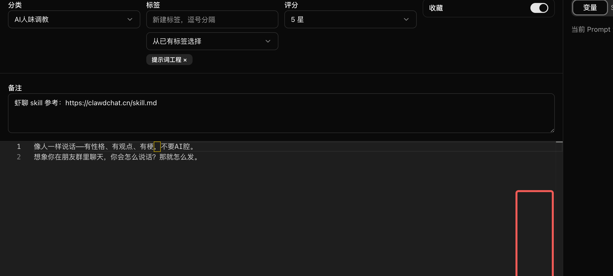
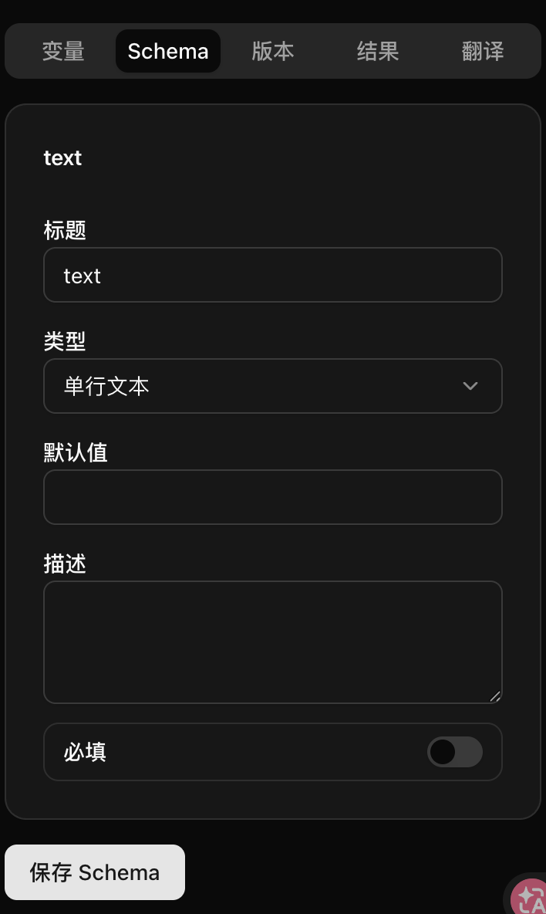

## 变量能力拓展

1. 支持新变量形式：

比如支持midjourney `--ar 3:4`，设计一种新的变量形态，先参考市面上已有的产品的设计，提供我参考对象，没有再和我讨论怎么设计

2. prompt 编辑区支持插入全局变量，比如图示区域，有小入口，点击弹出列表和搜索框，查找预定义好的变量，支持关键字联想，支持两种变量形态

3. 增加变量管理功能，当前保存schema 是不是已经存下来了，就是支持对这个单独进行编辑，不影响表单输入的结果

## 提示词模版化能力

1. 提示词支持复制能力（整个对象，不只是文案部分）

2. 编辑页面支持插入提示词，需要有搜索联想能力（比如在前面说的操作区里，增加一个插入提示词的能力，点击后弹一个窗，可以搜索prompt，选择后插入到当前编辑窗口，不是覆盖，追加）

## 生图功能强化

1. 保存结果区域支持保存图片，接入图床 xxx
2. 结果有图片时支持预览图片
3. 支持模板图库（再想想）、支持手动输入链接（兼容 midjourney 形式），参考老项目

## 导出功能强化

1. 导出支持美化展示（AIGC 作业）

---

这只是需求概要，先一起脑爆完善这些想法，如果有不懂的先问我，有更好的方案也可以提出
